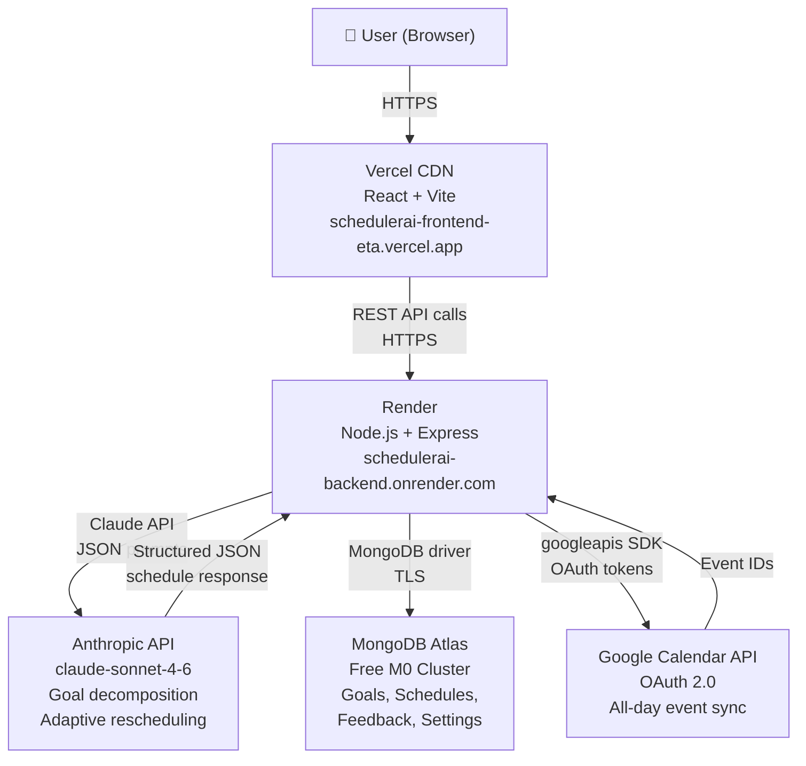
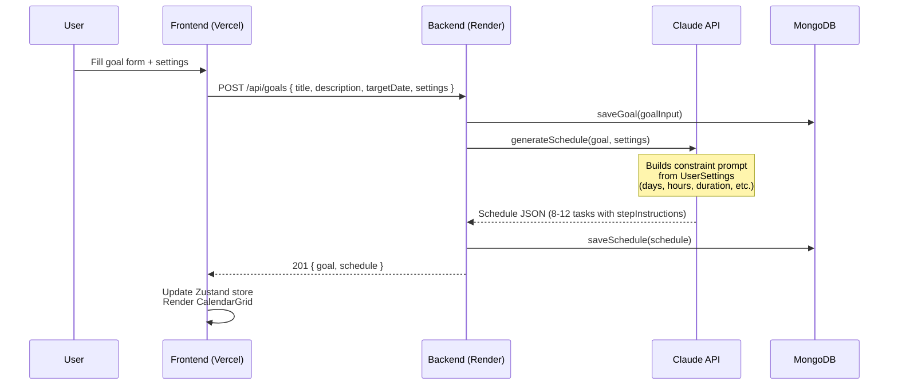
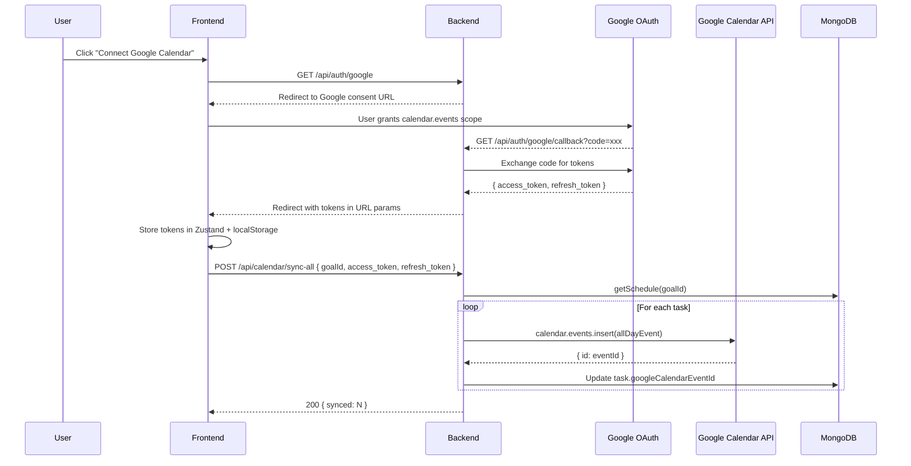

# Architecture

## Overview

SchedulerAI is a full-stack AI-powered scheduling application. It follows a three-layer architecture: a React frontend served from Vercel, an Express backend running on Render, and Claude as the AI reasoning layer. MongoDB Atlas persists all application state; Google Calendar provides optional event sync via OAuth 2.0.

---

## System Architecture Diagram



---

## Request Flow — Goal Submission



---

## Request Flow — Feedback & Adaptation


---

## Request Flow — Google Calendar Sync



---

## Frontend Architecture

### Component Tree

```
App (root)
├── ErrorBoundary
├── Header
│   └── Buttons: Settings, History, Give Feedback, Connect Calendar, Change Goal
├── ProgressBar
├── CalendarGrid
│   └── TaskCard (× N per day cell)
├── TaskDetail (modal, conditional)
├── FeedbackModal (modal, conditional)
│   ├── StarRating
│   ├── ScheduleChanges
│   └── FeedbackHistory
├── SettingsPanel (modal, conditional)
├── HistoryPanel (modal, conditional)
├── GoogleConnectPrompt (modal, conditional)
├── Toast (conditional)
└── CalendarSkeleton (loading state)
```

### State Management

State is managed by a single Zustand store (`useAppStore`). No prop drilling — all components subscribe to store slices directly. Relevant state is persisted to `localStorage` on every mutation so the app survives page refreshes without re-fetching from the API.

Key store slices:
- `activeGoalId` / `goals` / `schedules` — goal and schedule data
- `selectedTaskId` — which task's detail modal is open
- `googleTokens` — OAuth tokens for Google Calendar
- `settings` — per-goal scheduling preferences
- `toast` — transient notification state

---

## Backend Architecture

### Route Structure

```
POST   /api/goals                          — Submit goal, generate AI schedule
GET    /api/goals                          — List all goals
GET    /api/goals/:id/schedule             — Get schedule for a goal
PATCH  /api/goals/:goalId/tasks/:taskId    — Update task status
PATCH  /api/goals/:goalId/tasks/:taskId/steps — Update completed steps
POST   /api/feedback                       — Submit feedback, adapt schedule
GET    /api/auth/google                    — Initiate Google OAuth
GET    /api/auth/google/callback           — Handle OAuth callback
POST   /api/calendar/sync                  — Sync single task to Google Calendar
POST   /api/calendar/sync-all             — Sync all tasks for a goal
```

### Service Layer

- `services/db.ts` — MongoDB wrapper; all database reads/writes go through named functions (`saveGoal`, `getSchedule`, `saveFeedback`, etc.). No route handler touches the MongoDB driver directly.
- `services/anthropic.ts` — Claude API client; exports `generateSchedule` and `adaptSchedule`. Handles prompt construction, JSON fence stripping, and response parsing.
- `services/googleCalendar.ts` — Google Calendar API client; exports `getAuthUrl`, `exchangeCode`, `insertEvent`, and `updateEvent`.

---

## Database Schema

### `goals` collection
```json
{
  "id": "uuid-v4",
  "title": "string",
  "description": "string",
  "targetDate": "YYYY-MM-DD",
  "createdAt": "ISO 8601 timestamp"
}
```
Index: `{ id: 1 }` unique

### `schedules` collection
```json
{
  "goalId": "uuid-v4",
  "tasks": [
    {
      "id": "uuid-v4",
      "goalId": "uuid-v4",
      "title": "string",
      "description": "string",
      "scheduledDate": "YYYY-MM-DD",
      "estimatedMinutes": "number",
      "status": "pending | complete | skipped",
      "stepInstructions": ["markdown string"],
      "completedSteps": [0, 2],
      "googleCalendarEventId": "string | undefined"
    }
  ]
}
```
Index: `{ goalId: 1 }` unique

### `feedback` collection
```json
{
  "id": "uuid-v4",
  "scheduleId": "uuid-v4 (= goalId)",
  "rating": "1-5",
  "notes": "string",
  "createdAt": "ISO 8601 timestamp"
}
```
Index: `{ scheduleId: 1 }`

### `settings` collection
```json
{
  "goalId": "uuid-v4",
  "availableDays": [1, 2, 3, 4, 5],
  "dailyStartTime": "HH:MM",
  "dailyEndTime": "HH:MM",
  "minTaskDuration": "number (minutes)",
  "maxTaskDuration": "number (minutes)",
  "difficultyRamp": "gradual | steep | flat",
  "weeklyReviewDay": "0-6",
  "blackoutDates": ["YYYY-MM-DD"],
  "timezone": "IANA timezone string"
}
```

---

## AI Prompt Architecture

### Goal → Schedule Prompt

Takes `GoalInput` + `UserSettings`. Constructs a HARD REQUIREMENTS block containing:
- Available days of the week
- Daily time window (start/end)
- Min/max task duration bounds
- Difficulty ramp preference (`gradual`, `steep`, or `flat`)
- Blackout dates to skip

Claude returns structured JSON with 8–12 tasks. Each task includes a `stepInstructions` array of 3–7 markdown-formatted strings covering exactly how to complete that session.

### Feedback → Adaptation Prompt

Takes the current `Schedule` + `FeedbackEntry` + `UserSettings`. Instructs Claude to:
- Preserve all `complete` and `skipped` tasks exactly as-is
- Only reschedule `pending` tasks
- Return a `changesExplained` string summarising what changed and why, in plain English

### JSON Fence Stripping

Both prompts post-process the raw API response with:
```typescript
response.replace(/^```(?:json)?\n?/, '').replace(/\n?```$/, '')
```
This handles cases where Claude wraps its JSON output in ` ```json ``` ` fences.
