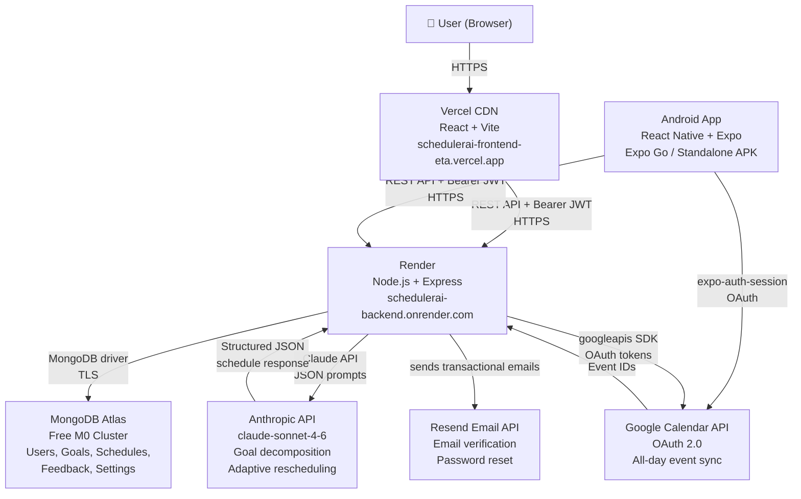
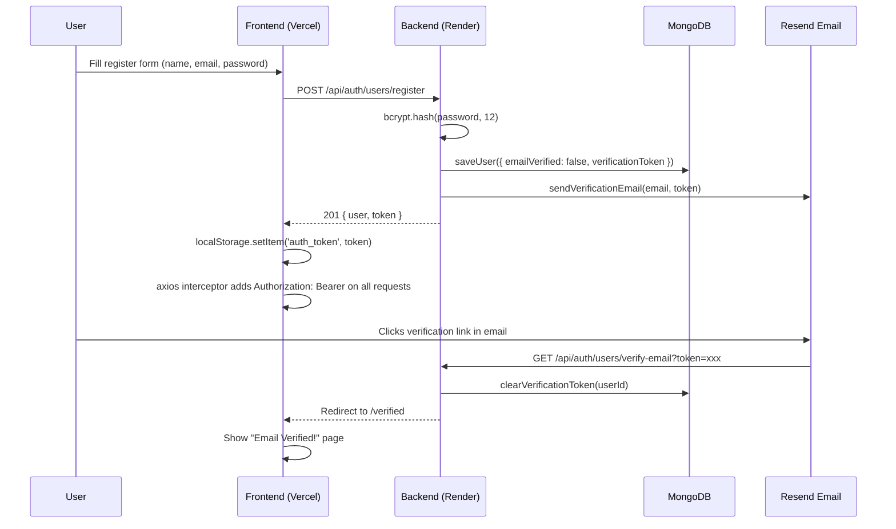
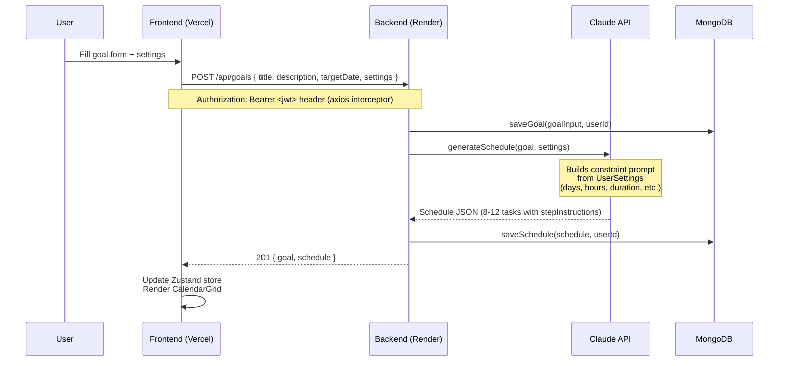
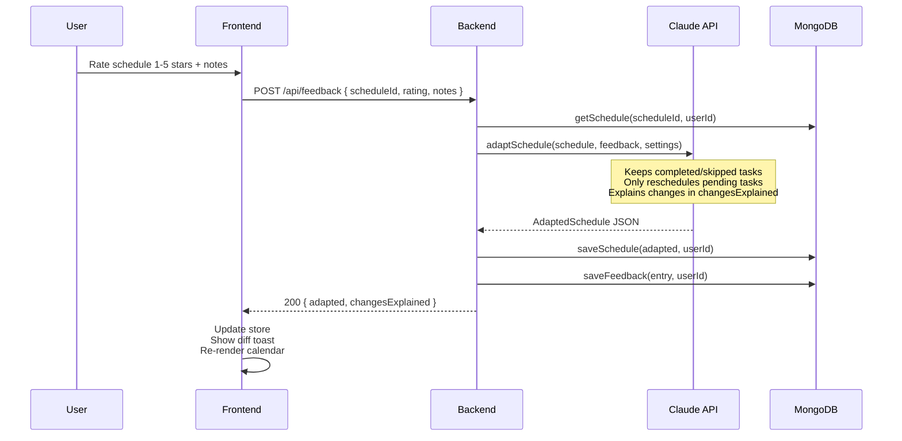
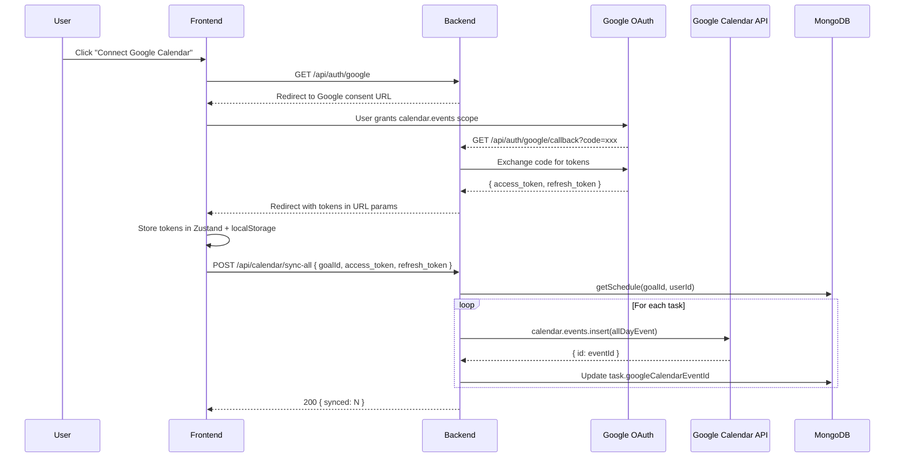

# Architecture

## Overview

SchedulerAI is a full-stack AI-powered scheduling application. It follows a three-layer architecture: a React frontend served from Vercel, an Express backend running on Render, and Claude as the AI reasoning layer. MongoDB Atlas persists all application state; Google Calendar provides optional event sync via OAuth 2.0; Resend handles transactional email (verification and password reset).

---

## System Architecture Diagram



> **Auth boundary:** All routes except `POST /api/auth/users/register`, `POST /api/auth/users/login`, and `GET /api/auth/users/verify-email` require a valid JWT in the `Authorization: Bearer <token>` header. Admin routes additionally require `isAdmin: true` on the user account.

---

## Request Flow — Registration & Email Verification



---

## Request Flow — Goal Submission



---

## Request Flow — Feedback & Adaptation



---

## Request Flow — Google Calendar Sync



---

## Frontend Architecture

### Component Tree

```
App (root)
├── ErrorBoundary
├── LoginPage (shown when !isAuthenticated)
├── EmailVerified (shown at /verified route)
├── Header
│   └── Buttons: Admin, Settings, My Goals, History, Give Feedback, Connect Calendar, Change Goal
├── ProgressBar
├── CalendarGrid
│   └── TaskCard (× N per day cell)
├── TaskDetail (modal, conditional)
├── FeedbackModal (modal, conditional)
│   ├── StarRating
│   ├── ScheduleChanges
│   └── FeedbackHistory
├── SettingsPanel (modal, conditional)
├── HistoryPanel (modal, conditional)
├── GoalSwitcher (modal, shown from "My Goals" button)
│   └── GoalCard
├── AdminPanel (modal, only rendered for isAdmin users)
├── GoogleConnectPrompt (modal, conditional)
├── Toast (conditional)
└── CalendarSkeleton (loading state)
```

### State Management

State is managed by a single Zustand store (`useAppStore`). No prop drilling — all components subscribe to store slices directly. Relevant state is persisted to `localStorage` on every mutation so the app survives page refreshes without re-fetching from the API.

Key store slices:
- `currentUser` / `isAuthenticated` / `authLoading` — authentication state
- `activeGoalId` / `goals` / `schedules` — goal and schedule data
- `selectedTaskId` — which task's detail modal is open
- `googleTokens` — OAuth tokens for Google Calendar
- `settings` — per-goal scheduling preferences
- `toast` — transient notification state
- `isAdminPanelOpen` / `isGoalSwitcherOpen` / `isSettingsPanelOpen` / `isHistoryPanelOpen` — modal visibility flags

---

## Mobile Architecture (React Native + Expo)

### Tech Stack

| Layer | Technology |
|---|---|
| Framework | Expo SDK 54 / React Native 0.81 |
| Navigation | expo-router v3 (file-based, tab + stack) |
| Auth / OAuth | expo-auth-session (Google Sign-In + Calendar OAuth) |
| Secure storage | expo-secure-store (JWT token, replaces `localStorage`) |
| Data fetching | @tanstack/react-query |
| State management | Zustand v5 (same pattern as web) |
| Styling | NativeWind v3 + Tailwind CSS v3 |
| Calendar grid | react-native-calendars |
| Date/time inputs | @react-native-community/datetimepicker |
| Markdown rendering | react-native-markdown-display |

### Screen Structure

```
mobile/app/
├── index.tsx                Auth gate — calls GET /api/auth/users/me, redirects
├── (auth)/
│   ├── login.tsx            Login + Register (email/password + Google Sign-In)
│   └── verified.tsx         Email verified success screen
└── (app)/                   Authenticated tab screens
    ├── _layout.tsx          Tab bar: Home · Goals · Settings · Admin (admin only)
    ├── index.tsx            Home — GoalInputScreen or CalendarScreen
    ├── goals.tsx            Goal switcher (open / delete goals)
    ├── settings.tsx         Settings + Google Calendar + Feedback History
    └── admin.tsx            Admin panel (users list, suspend/delete/reset)
```

### Component Structure

```
mobile/components/
├── ui/                      Button, Input, Card, Badge, Toast
├── Calendar/
│   └── CalendarScreen.tsx   react-native-calendars grid + task list + progress bar
├── TaskCard/
│   ├── TaskChip.tsx         Status-coloured task row (left accent bar)
│   └── TaskDetailSheet.tsx  RN Modal bottom sheet — steps, status actions, Google sync
├── Feedback/
│   ├── FeedbackModal.tsx    Star rating, scope pills, notes input
│   └── FeedbackHistory.tsx  FlatList of past feedback entries per goal
├── GoalInput/
│   └── GoalInputScreen.tsx  Goal form with date picker and scheduling constraints
├── Header.tsx               SafeAreaView top bar with optional right action
└── ScreenWrapper.tsx        SafeAreaView bottom + optional ScrollView
```

### Key Differences from Web

| Concern | Web | Mobile |
|---|---|---|
| JWT storage | `localStorage` | `expo-secure-store` (encrypted Android Keystore) |
| Auth header | axios interceptor reads `localStorage` | axios interceptor calls `SecureStore.getItemAsync()` |
| Bottom sheets | Custom modal components | React Native `Modal` (`animationType="slide"`) |
| Styling | Tailwind CSS v4 (`@theme` blocks) | NativeWind v3 + Tailwind v3 (`tailwind.config.js`) |
| Date inputs | `<input type="date">` | Platform-split: Android dialog / iOS bottom sheet |
| Google Calendar OAuth | Server-side redirect flow | `expo-auth-session` + `POST /api/calendar/connect-mobile` |
| Markdown | `react-markdown` | `react-native-markdown-display` |

---

## Backend Architecture

### Route Structure

```
— Auth (no JWT required) —
POST   /api/auth/users/register            — Email/password registration
POST   /api/auth/users/login               — Email/password login
GET    /api/auth/users/verify-email        — Verify email token (redirect)

— Auth (JWT required) —
POST   /api/auth/users/logout              — Clear session cookie
GET    /api/auth/users/me                  — Get current user
POST   /api/auth/users/resend-verification — Resend verification email

— Google Sign-In (no JWT required) —
GET    /api/auth/users/google              — Initiate Google Sign-In
GET    /api/auth/users/google/callback     — Handle Google Sign-In callback

— Google Calendar OAuth (no JWT required) —
GET    /api/auth/google                    — Initiate Google Calendar OAuth
GET    /api/auth/google/callback           — Handle Calendar OAuth callback

— Goals (JWT required) —
POST   /api/goals                          — Submit goal, generate AI schedule
GET    /api/goals                          — List goals for current user
GET    /api/goals/:id/schedule             — Get schedule for a goal
PATCH  /api/goals/:goalId/tasks/:taskId    — Update task status
PATCH  /api/goals/:goalId/tasks/:taskId/steps — Update completed steps

— Feedback (JWT required) —
POST   /api/feedback                       — Submit feedback, adapt schedule

— Calendar (JWT required) —
POST   /api/calendar/sync                  — Sync single task to Google Calendar
POST   /api/calendar/sync-all             — Sync all tasks for a goal
POST   /api/calendar/connect-mobile       — Accept OAuth tokens from mobile app (expo-auth-session)

— Admin (JWT + isAdmin required) —
GET    /api/admin/users                    — List all users with goal counts
DELETE /api/admin/users/:userId            — Delete user + all data (cascade)
PATCH  /api/admin/users/:userId/suspend    — Toggle user suspension
PATCH  /api/admin/users/:userId/reset-password — Send password reset email
PATCH  /api/admin/users/:userId/toggle-admin   — Toggle admin status
```

### Middleware

- `requireAuth` — verifies `Authorization: Bearer <token>` header (or `auth_token` cookie fallback); decodes JWT; fetches user from DB to check `suspended` status; attaches `req.user` for downstream handlers.
- `requireAdmin` — checks `req.user.isAdmin`; must be chained after `requireAuth`.
- `errorHandler` — catches all `next(err)` calls and returns `{ error: message }` JSON.

### Service Layer

- `services/db.ts` — MongoDB wrapper; all database reads/writes go through named functions (`saveGoal`, `getSchedule`, `saveFeedback`, `getUserById`, etc.). No route handler touches the MongoDB driver directly. All collections except `users` are scoped by `userId`.
- `services/anthropic.ts` — Claude API client; exports `generateSchedule` and `adaptSchedule`. Handles prompt construction, JSON fence stripping, and response parsing.
- `services/googleCalendar.ts` — Google Calendar API client; exports `getAuthUrl`, `exchangeCode`, `createCalendarEvent`, and related helpers.
- `services/email.ts` — Resend SDK wrapper; exports `sendVerificationEmail` and `sendPasswordResetEmail`.

---

## Database Schema

### `users` collection
```json
{
  "id": "uuid-v4",
  "email": "string",
  "passwordHash": "string (optional — absent for Google Sign-In accounts)",
  "googleId": "string (optional — present only for Google Sign-In accounts)",
  "displayName": "string",
  "emailVerified": "boolean",
  "isAdmin": "boolean (optional — default absent/false)",
  "suspended": "boolean (optional — default absent/false)",
  "verificationToken": "string (optional — cleared on verification)",
  "passwordResetToken": "string (optional — set by admin reset)",
  "createdAt": "ISO 8601 timestamp"
}
```
Index: `{ id: 1 }` unique, `{ email: 1 }` unique

### `goals` collection
```json
{
  "id": "uuid-v4",
  "userId": "uuid-v4 (owner)",
  "title": "string",
  "description": "string",
  "targetDate": "YYYY-MM-DD",
  "createdAt": "ISO 8601 timestamp"
}
```
Index: `{ id: 1 }` unique. All queries filter by `userId`.

### `schedules` collection
```json
{
  "goalId": "uuid-v4",
  "userId": "uuid-v4 (owner)",
  "tasks": [
    {
      "id": "uuid-v4",
      "goalId": "uuid-v4",
      "title": "string",
      "description": "string",
      "scheduledDate": "YYYY-MM-DD",
      "estimatedMinutes": "number",
      "status": "pending | complete | skipped",
      "stepInstructions": ["markdown string"],
      "completedSteps": [0, 2],
      "googleCalendarEventId": "string | undefined"
    }
  ]
}
```
Index: `{ goalId: 1 }` unique. All queries filter by `userId`.

### `feedback` collection
```json
{
  "id": "uuid-v4",
  "userId": "uuid-v4 (owner)",
  "scheduleId": "uuid-v4 (= goalId)",
  "rating": "1-5",
  "notes": "string",
  "createdAt": "ISO 8601 timestamp"
}
```
Index: `{ scheduleId: 1 }`. All queries filter by `userId`.

### `settings` collection
```json
{
  "goalId": "uuid-v4",
  "userId": "uuid-v4 (owner)",
  "availableDays": [1, 2, 3, 4, 5],
  "dailyStartTime": "HH:MM",
  "dailyEndTime": "HH:MM",
  "minTaskDuration": "number (minutes)",
  "maxTaskDuration": "number (minutes)",
  "difficultyRamp": "gradual | steep | flat",
  "weeklyReviewDay": "0-6",
  "blackoutDates": ["YYYY-MM-DD"],
  "timezone": "IANA timezone string"
}
```
All queries filter by `userId`.

---

## AI Prompt Architecture

### Goal → Schedule Prompt

Takes `GoalInput` + `UserSettings`. Constructs a HARD REQUIREMENTS block containing:
- Available days of the week
- Daily time window (start/end)
- Min/max task duration bounds
- Difficulty ramp preference (`gradual`, `steep`, or `flat`)
- Blackout dates to skip

Claude returns structured JSON with 8–12 tasks. Each task includes a `stepInstructions` array of 3–7 markdown-formatted strings covering exactly how to complete that session.

### Feedback → Adaptation Prompt

Takes the current `Schedule` + `FeedbackEntry` + `UserSettings`. Instructs Claude to:
- Preserve all `complete` and `skipped` tasks exactly as-is
- Only reschedule `pending` tasks
- Return a `changesExplained` string summarising what changed and why, in plain English

### JSON Fence Stripping

Both prompts post-process the raw API response with:
```typescript
response.replace(/^```(?:json)?\n?/, '').replace(/\n?```$/, '')
```
This handles cases where Claude wraps its JSON output in ` ```json ``` ` fences.
